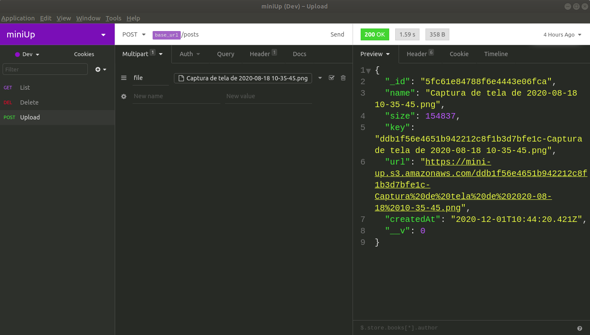

# miniUp

## What's it?
This is a service that upload files to Amazon S3. 

## Sample

## Requirements:
1. `node 10.21.0 or >`

## Running the project:

1. `cd miniUp`
2. `yarn`
3. `configure your .env file - Variables: APP_URL, STORAGE_TYPE, MONGO_URL, AWS_ACCESS_KEY_ID, AWS_SECRET_ACCESS_KEY and AWS_DEFAULT_REGION`
3. `yarn dev`